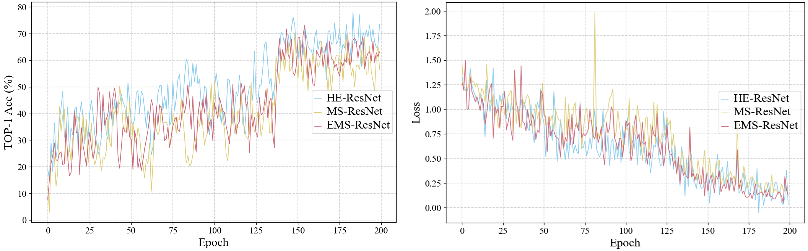

# Hyper Efficient Net
Hyper Efficient Neural Networks towards Spike-Driven Deep Residual Learning

Comparison with other state-of-the-art SNNs

## Conda Installation
We test our models under`python=3.7,pytorch=1.9.1,cuda=11.6`. 

1.  Install Pytorch and torchvision.
Follow the instruction on  [https://pytorch.org/get-started/locally/](https://pytorch.org/get-started/locally/).

`conda install -c pytorch pytorch torchvision`

2.   Install other needed packages
   
`pip install -r requirements.txt`

# Demo
1. We have put our model checkpoints here [HENet: Goole Drive](https://drive.google.com/drive/folders/1aA_ufYrPv-JKKdcs1X3BM9ipfrZxB32C)

2. Please download weights and organize them as following:

weights/

&emsp;  ├── detect/

&emsp;  ├── events/

&emsp;  └── CSNN-B/

&emsp;&emsp;&emsp;&emsp;&emsp; └── checkpoint0023.pth

3.  Run train.py and the results in `weights/xxx.pth`.
